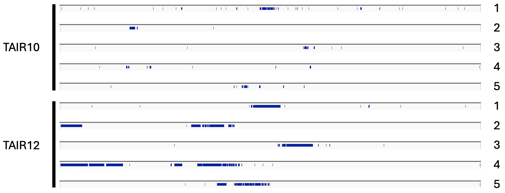

# TAIR12 Blacklist

This repository contains a blacklist for the TAIR12 assembly of _Arabidopsis thaliana_, and corresponding code used to generate it. The pipeline is meant to match the TAIR10 blacklist created by Klasfed et al. (2022).

There are two files: `tair12_bl_ens.bed` and `tair12_bl_ucsc.bed`. These are the same TAIR12 blacklist BED, with the chromosome names either in UCSC style (chr1, chr2, etc) or ENSEMBL style (1, 2, etc).

## Citation

Please use the Zenodo DOI to cite this blacklist if you find it useful in your research:

Tremblay, B.J.M. and Nobori, T. (2026). TAIR12 blacklist. _Zenodo_, DOI: XXX.

## TAIR10 versus TAIR12

Here is a quick visualization of the TAIR10 versus TAIR12 blacklist coverage across the 5 chromosomes (not to scale):



## Reproducing the blacklist

The following steps are targeted towards members of The Sainsbury Laboratory (TSL) using the NBI HPC, though anyone can modify the scripts so they can run in their own setups. These scripts also assume a specific directory structure, so read the scripts first before executing. They also contain paths specific to my username; be sure to modify them first.

### Step 1: Create Singularity containers

For each script in `defs/`, create containers on the `software` node of the HPC, for example:

```
sudo singularity build container.img container.def
```

### Step 2: Download the input datasets

Navigate to the appropriate folder in `/tsl/data/externalData` on the HPC via the local mount method on your personal computer and run the `import_raw_fasta_inputs.sh` script to download the ChIP-seq inputs using the [SRA Toolkit](https://github.com/ncbi/sra-tools). Since the HPC does not have internet access this is the simplest way to download them in my opinion. This input list is from Klasfeld et al. (2022).

### Step 3: Download the TAIR12 sequences

Go to the [TAIR website](https://www.arabidopsis.org) and download the TAIR12 assembly. Make sure to edit the chromosome names to be in UCSC style (chr1, chr2, chr3, chr4, chr5). Parts of the pipeline require this naming sceme. Also grab (or make) a `chrom.sizes` file. Quick tip: use `samtools faidx` to make one if you can't find one.

### Step 4: Align the input reads to TAIR12

Run the `bwa.sh` script to create the TAIR12 index and align the reads with `bwa`.

### Step 5: Run UMAP to get mappability tracks

Run the `init_script.sh` script using an interactive SLURM session (takes a second to finish). This will create a script called `umap_script.sh`, which is not suitable to run on the HPC. However the `init_script.sh` step also creates other necessary folders, so it must be run. Run the `umap_script_manual.sh` script instead.

### Step 6: Run the Blacklist tool to create the blacklist

Run the `blacklist.sh` script to generate the final blacklist files. The Blacklist program has been modified to allow for merging of blacklist ranges 5 Kbp apart, as noted in Klasfeld et al. (2022).

## References

Klasfeld, S., Roulé, T. and Wagner, D. (2022). Greenscreen: A simple method to remove artifactual signals and enrich for true peaks in genomic datasets using ChIP-seq data. _Plant Cell_ **34**, 4795-4815.

